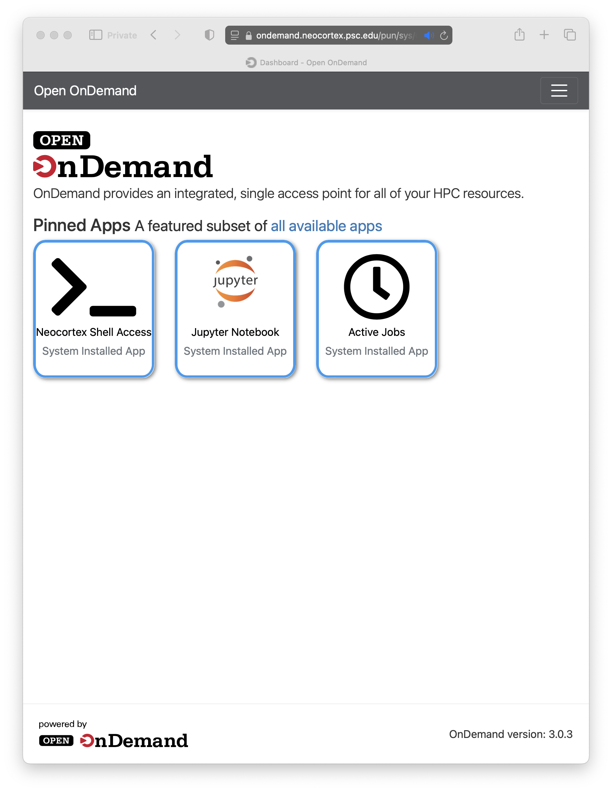
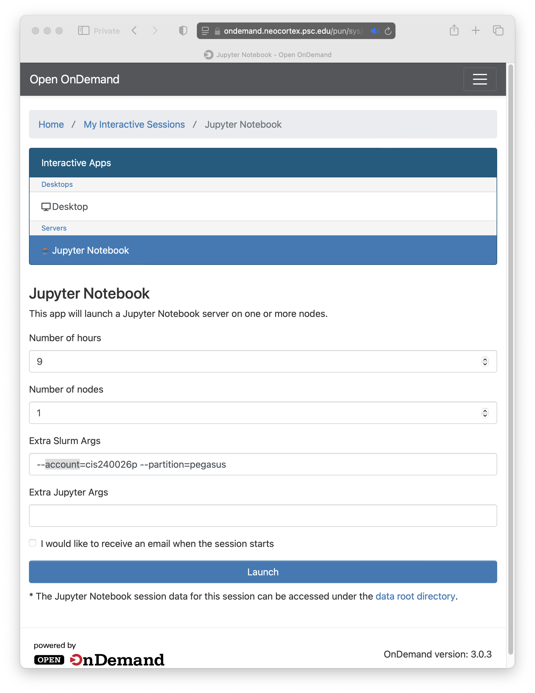
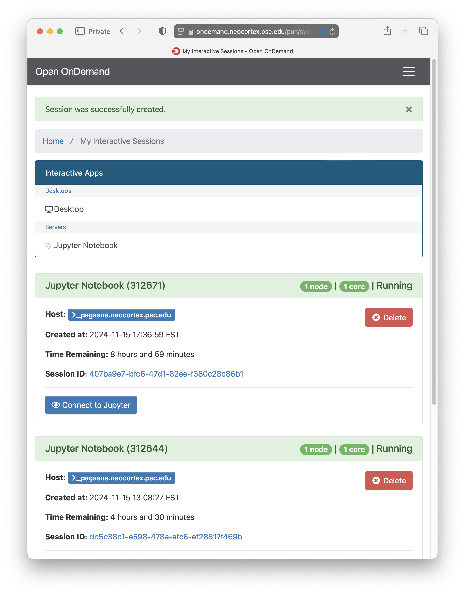
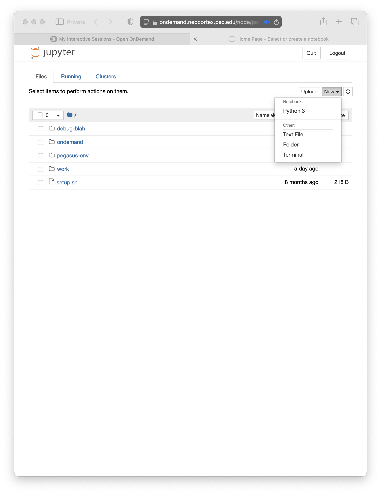

# Cerebras ModelZoo Training Workflows

This repository contains example Pegasus workflows that execute on the Cerebras machine at PSC called Neocortex. The examples are for some of the models in the [modelzoo](https://portal.neocortex.psc.edu/docs/modelzoo.html) that Cerebras has made availble for users to run. 

The workflows in this repository validate, compiles and trains the model.

At the moment we have example workflows for 

* Tensor Flow
* PyTorch 

The workflow is based on the example at 
[Running Jobs on Neocortex](https://portal.neocortex.psc.edu/docs/running-jobs.html) .


## Dependencies

1. Install [HTCondor](https://htcondor.readthedocs.io/en/latest/getting-htcondor/)
2. Install [Pegasus WMS](https://pegasus.isi.edu/documentation/user-guide/installation.html)

You can also refer to the overview on [deployment options](https://pegasus.isi.edu/docs/5.0.8dev/user-guide/deployment-scenarios.html#hpc-clusters-system-install) 
and select what works best for your setup.

## Container

All the jobs are run via a Cerebras provided singularity container that is 
available on the shared filesystem.


## Logging onto Open OnDemand for Jupyter Notebooks

The workflows also have an associated jupyter notebook that you can be executed via the 
[Open OnDemand](https://ondemand.neocortex.psc.edu) instance on Neocortex. Login
using your PSC credentials there.

### Launching the notebook

After logging in, you would see a home page similar to one below



Click on the Jupyter System Installed Apps. That will take you to launch page for the
Jupyter Notebook.

Take note of the extra slurm argments that are passed

* account - that should be your account. not the one in the image below
* partition - we need to launch the notebook on a slurm partition called **pegasus**. This
              is required to ensure your notebook runs on a node, where Pegasus and HTCondor
              are installed and preconfigured.



Once your JupyterLab Session starts, Click Connect to Jupyter button.



From there, Click on File -> New and then click on Terminal to get the terminal



Once in the terminal, clone this GitHub Repository.

```
git clone https://github.com/pegasus-isi/cerebras-modelzoo.git
```

Then, in Jupyter, navigate to the example you are interested in, and step through the notebook.


