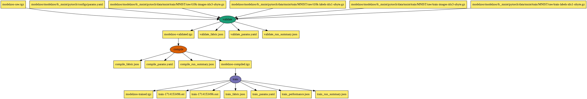

# Cerebras ModelZoo Training Workflow

This Pegasus workflow validates, compiles and trains the model
using PyTorch as part of a single worklfow setup to run on Neocortex.


[Running Jobs on Neocortex](https://portal.neocortex.psc.edu/docs/running-jobs.html) 


## Container
All the jobs are run via a Cerebras provided singularity container that is 
available on the shared filesystem.

## Setting up the input data for the workflow 

```
$  ./executables/prepare_inputs.sh 
...
modelzoo/user_scripts/csrun_wse
         11,308 100%   43.14kB/s    0:00:00 (xfr#615, to-chk=0/772)
Removing params.yaml from pytorch config dir
Tarring up the git checkout to /jet/home/vahi/work/cerebras-modelzoo/pt/input/modelzoo-raw.tgz
```

The workflow also requires additional inputs to be placed in the input directory namely
the *params.yaml* file for the training. The training datasets are tracked as part of the workflow
and downloaded at runtime from the http://yann.lecun.com/exdb/mnist/ 

These are the inputs on which you do the training 

* modelzoo/modelzoo/fc_mnist/pytorch/data/mnist/train/MNIST/raw/train-images-idx3-ubyte.gz
* modelzoo/modelzoo/fc_mnist/pytorch/data/mnist/train/MNIST/raw/train-labels-idx1-ubyte.gz
* modelzoo/modelzoo/fc_mnist/pytorch/data/mnist/train/MNIST/raw/t10k-images-idx3-ubyte.gz
* modelzoo/modelzoo/fc_mnist/pytorch/data/mnist/train/MNIST/raw/t10k-labels-idx1-ubyte.gz


## Workflow

The Pegasus workflow starts with a tar file containing the Git checkout of 
the modelzoo repo, and iterates on it



### Running the workflow

You can run the workflow from neocortex login node as follow

```
$./cerebras-modelzoo-pt.py --project $SALLOC_ACCOUNT
```
